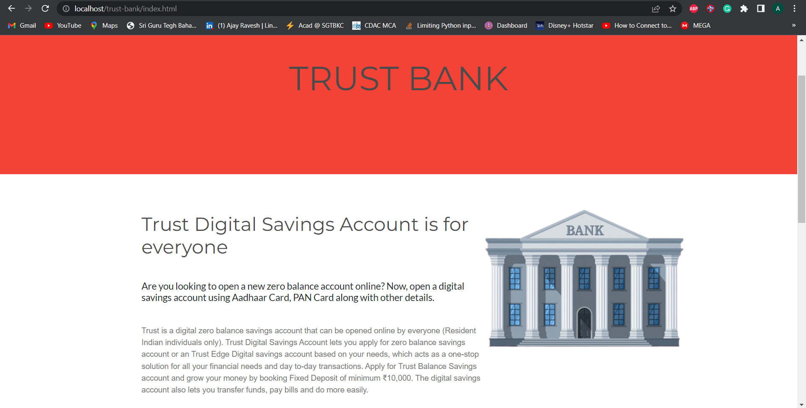

# Tust-Bank

This repository contains the tasks that I completed while working as an Intern at The Sparks Foundation. GRIP (Graduate Rotational Internship Program)  Sparks Foundation Web Development and Designing Internship 

## Task-1 Basic Banking System
Flow: Home Page > View all Customers > Select and View one Customer > Transfer Money > Select customer to transfer to > View all Customers.


## LinkedIn

- [Ajay Ravesh](https://www.linkedin.com/in/ajayravesh)


## Run Locally

Clone the project

```bash
  git clone https://github.com/ajay2205/trust-bank.git
```

clone the project in this directory of xampp folder

```bash
  xampp/htdocs
```

Start the xampp server

Paste the link in the browser
```bash
 localhost/trust-bank 
```


## Screenshots



